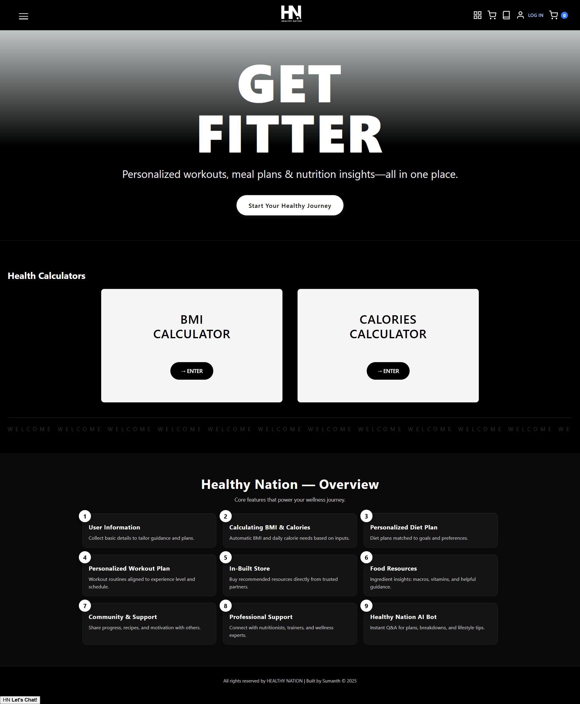

# HEALTHY NATION 🏥

> **2nd Year Lab Project (2024)**
> A holistic health ecosystem MVP. Visualized in Wix Studio and reverse-engineered into a high-performance static web application.

## 🖼️ Project Preview

*(Snapshot of the final MVP interface)*

## 🚀 Live Access
| **Platform** | **Link** |
| :--- | :--- |
| **Live Site (GitHub Pages)** | [**🔗 Launch Application**](https://sumanthkatta-dev.github.io/Healthy-Nation/) |
| **Original Design** | [**🎨 View Wix Studio Prototype**](https://sumanthkatta20055.wixstudio.com/my-site-1) |

> **⚠️ Note on "Dangerous Site" Warning**
> Google's security bots may flag this new student domain as a false positive.
> **To bypass:** Click **"Details"** → **"Visit this unsafe site"** (underlined).
> *This is a 100% static, safe educational project.*

---

## 🔄 User Experience (UX) Journey
The application is designed as a linear, logic-driven ecosystem that guides the user from assessment to action:

1.  **📊 Biometric Assessment**
    * **Input:** User enters height, weight, and age.
    * **Processing:** The system calculates **BMI** (Body Mass Index) and **TDEE** (Total Daily Energy Expenditure) to establish a health baseline.
2.  **🥗 Nutritional Strategy**
    * Based on the calculated biological metrics, the system generates a tailored diet chart optimized for the user's specific age group and caloric needs.
3.  **💪 Fitness Regimens**
    * Users are assigned a workout plan corresponding to their calculated "Fitness Level" (Beginner/Intermediate/Advanced) to ensure safe progression.
4.  **🛒 Integrated Marketplace**
    * **Closing the Loop:** A built-in e-commerce interface allows users to immediately source recommended nutrition (fresh produce, lean proteins, supplements) directly within the app flow.

---

## 📘 Technical Case Study: Design-to-Code
This project served as a case study in **Rapid Prototyping & MVP Development**:

### Phase 1: High-Fidelity Prototyping
Before writing code, the UX was architected using **[Wix Studio](https://www.wix.com/studio)**. This allowed for rapid iteration on visual hierarchy and user flow validation.
* **Tool:** Wix Studio
* **Objective:** Validate the "Assessment-to-Marketplace" funnel.

### Phase 2: Technical Implementation
The validated design was **reverse-engineered** into a dependency-free codebase to ensure maximum performance and portability:
* **Frontend:** Semantic HTML5, CSS3 (Flexbox/Grid), and Vanilla JavaScript.
* **Backend Logic:** Python and Java modules were integrated for data processing requirements during academic evaluation.
* **Optimization:** Zero external framework dependencies for instant load times.

## 🏗️ Technical Architecture
* `index.html`: Hero section, Value Proposition, and Routing.
* `tools.html`: The logic engine handling BMI & Calorie calculations.
* `diet-plan.html`: Dynamic nutritional data rendering based on user inputs.
* `shop.html`: The frontend commerce layer for the grocery marketplace.
